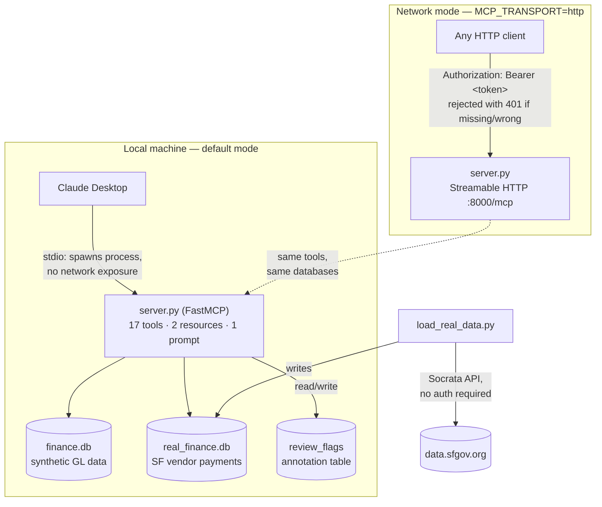

# Financial Records MCP — Project Walkthrough

This document explains what we built, step by step, in plain language: what each
piece of code does, why it was built that way, and why the whole thing is
actually useful rather than just a toy exercise.

---

## The big idea, in one paragraph

MCP (Model Context Protocol) is a standard way to give an LLM access to *your*
data and *your* tools, instead of only what it learned during training. This
project builds an MCP server that lets Claude query, analyze, and annotate
real financial data — first a synthetic practice dataset, then real municipal
spending data from San Francisco's open data portal. The point isn't the
finance data specifically; it's learning the actual mechanics of connecting an
LLM to a live system: reading data safely, writing to it responsibly, and
securing it properly. Those mechanics transfer directly to connecting Claude
to *your* company's SAP/Snowflake data later.

---

## Architecture



Two things worth reading off this diagram directly: the **synthetic and real
datasets sit side by side** behind the same server (nothing forces a choice
between them), and the **HTTP+auth path is an alternate way to reach the
exact same tools** — it's not a separate server, just a different transport
wrapped around identical logic.

---

## Step 1 — A synthetic practice database

**File: `generate_data.py`**

Before touching MCP at all, we needed something to query. This script builds
`finance.db`, a small SQLite database shaped like a real general ledger:

- `accounts` — a chart of accounts (14 rows: Cash, Accounts Payable, Product
  Revenue, Marketing, etc.), each with a GL code and an account type
  (Asset/Liability/Revenue/Expense) — loosely modeled on SAP's structure.
- `transactions` — ~1,450 transactions over 24 months, with categories,
  vendors, cost centers.

To make it useful for testing analytics later, it's not just random noise:

- **Seasonality** — categories like Sponsorships and Airfare spike in
  specific months (conference season, year-end).
- **Recurring subscriptions** — five vendor/category pairs repeat monthly at
  a near-fixed price, the way real SaaS bills do.
- **Planted anomalies** — 16 transactions get their amount multiplied 5–12x.
  Critically, the IDs of these anomalies are written to
  `anomalies_ground_truth.csv`, a file the MCP server *never reads*. This let
  us later score an anomaly-detection tool honestly, without it having secret
  access to the answer key.

**Why start here instead of real data immediately?** Building the MCP
mechanics against data you fully control (and know the "right answers" for)
makes bugs obvious. Once the plumbing worked, swapping in real data was just
a new loader script — the hard part (the server) didn't need to change.

---

## Step 2 — The MCP server itself

**File: `server.py`**

This is the only file that knows about the MCP protocol. Everything else is
just data.

### The core trick: decorators generate the protocol for you

```python
from mcp.server.fastmcp import FastMCP
mcp = FastMCP("Financial Records")

@mcp.tool()
def get_account_balance(account_id: str) -> dict:
    """
    Get the current balance for a single account.

    Args:
        account_id: The account ID, e.g. "E6100" for Marketing and Advertising.
    """
    ...
```

`@mcp.tool()` does three things automatically, at the moment Python imports
this function:

1. **Reads the type hints** (`account_id: str`) and builds a JSON Schema from
   them — this is what a client asks for via `tools/list`.
2. **Reads the docstring** — the summary becomes the tool's description, and
   the `Args:` section becomes per-parameter descriptions. This is what
   Claude actually reads to decide *when* to call a tool and *how* to fill in
   its arguments, so docstring quality directly affects how well it gets used.
3. **Registers the function** so it's dispatched automatically when a
   `tools/call` request for that name arrives.

No manual routing code, no hand-written JSON Schema, no protocol parsing.
That's the entire value of `FastMCP` over implementing MCP from scratch.

### Every query is parameterized — always

```python
clauses.append("t.account_id = ?")
params.append(account_id)
...
query = f"... WHERE {' AND '.join(clauses)} ..."
```

The f-string only builds the *shape* of the query (`column = ?`); actual
values always go through `params` and get bound via `?` placeholders. This
matters more here than in typical app code, because the values in `params`
originate from an LLM's tool call — which may itself have been influenced by
untrusted text it was processing. Treat model-generated tool arguments the
way you'd treat unauthenticated user input.

### Read-only by default

```python
conn = sqlite3.connect(f"file:{DB_PATH}?mode=ro", uri=True)
```

`mode=ro` means SQLite refuses to write, at the driver level, even if a bug
in the SQL tried to. The only table that's ever opened read-write is
`review_flags` (see Step 5) — everything else stays a read path.

---

## Step 3 — Testing without Claude at all

**File: `test_client.py`**

Before wiring anything into Claude Desktop, we needed to prove the server
actually worked. `test_client.py` is a minimal *client*: it spawns
`server.py` as a subprocess (exactly like Claude Desktop does), does the
protocol handshake, lists tools, and calls a few directly:

```python
params = StdioServerParameters(command="python", args=["server.py"])
async with stdio_client(params) as (read, write):
    async with ClientSession(read, write) as session:
        await session.initialize()
        result = await session.call_tool("monthly_summary", {"year": 2026, "month": 3})
```

This is functionally identical to what Claude Desktop does when it reads
your config — just with you hardcoding the calls instead of an LLM deciding
them. Useful both for initial testing and for validating new tools before
ever touching the Claude Desktop config (which is harder to debug when
something's wrong, since failures are often silent).

---

## Step 4 — Connecting to Claude Desktop

Claude Desktop spawns your server as a subprocess based on a config file. The
tricky part in practice wasn't the MCP concepts — it was **finding the right
config file**, since Claude Desktop's packaged Windows build stores it in a
virtualized path (`AppData\Local\Packages\Claude_<id>\LocalCache\Roaming\Claude\`),
not the plain `%APPDATA%\Claude\` path older guides mention. The fix was
always going through **Settings → Developer → Edit Config** in the app
itself, which guarantees you're editing the exact file it reads.

Once connected, the request flow for any tool call is:

1. Claude Desktop starts `python server.py`, does a JSON-RPC handshake over
   stdin/stdout.
2. It calls `tools/list` — your server responds with all registered tools'
   auto-generated schemas.
3. Mid-conversation, the model decides a tool is relevant and Claude Desktop
   sends `tools/call` with arguments.
4. FastMCP validates the arguments against the schema, calls your Python
   function, gets back a `dict` or `list`.
5. FastMCP serializes that into a response; Claude Desktop feeds it back into
   the model's context, which writes its answer using the real numbers.

---

## Step 5 — Analytics tools (z-scores and trend forecasting)

**Tools: `detect_spending_anomalies`, `forecast_category_spend`**

Two tools using `pandas`/`numpy` on top of the synthetic data:

- **`detect_spending_anomalies`** computes a z-score for each transaction
  relative to its own category's mean and standard deviation, flagging
  anything beyond a threshold (default 2.5σ). Categories with fewer than 5
  transactions are skipped — not enough history to know what "normal" is.
- **`forecast_category_spend`** fits a simple linear trend
  (`np.polyfit`, degree 1) over a category's monthly totals and projects
  forward, reporting R² so the caller knows how much to trust the forecast.

**We scored the anomaly detector against the ground truth from Step 1** and
got 50% recall / 57% precision — a mediocre result, and a genuinely useful
one to see honestly rather than just declaring victory. It revealed a real
limitation of z-score-based detection: categories with wide natural variance
(like revenue) can hide a planted anomaly, while small, noisy categories
throw false positives just from having too little data to estimate a
reliable mean/std. That's exactly the kind of finding worth knowing before
trusting a technique like this on data that actually matters.

---

## Step 6 — Real data: San Francisco vendor payments

**File: `load_real_data.py`**

We swapped the synthetic dataset for [San Francisco's Vendor Payments
(Purchase Order Summary)](https://data.sfgov.org/City-Management-and-Ethics/Vendor-Payments-Purchase-Order-Summary-/p5r5-fd7g)
dataset — real municipal GL data, updated weekly, publicly queryable via the
Socrata API with no authentication needed.

The loader:
1. Calls the API in paginated batches (`$limit`/`$offset`), filtered to
   specific fiscal years via `$where`.
2. Transforms each row — parsing amounts, normalizing missing/malformed
   dates (many real rows genuinely have no payment date), deduplicating
   departments into a lookup table.
3. Writes to `real_finance.db`: a `departments` table and a `payments` table.

This is meaningfully messier than the synthetic data — negative amounts
(credits/refunds are common), missing dates, one department (Health Service
System) dwarfing every other department by orders of magnitude
(~$7.5B vs. the next department's ~$155M, reflecting the city's pension and
health benefit obligations). That messiness is the point: it's what real
data actually looks like, and the tools had to handle it correctly (they
did — verified by testing negative-amount payments surface correctly through
`search_payments`, and that filters combine correctly across department,
category, fiscal year, and date range).

Six new tools (`list_departments`, `get_department_spend`, `get_payments`,
`search_payments`, `real_spending_by_category`, `fiscal_year_summary`) sit
alongside — not replacing — the synthetic-data tools, so both datasets are
queryable in the same conversation.

---

## Step 7 — Writes: the review-flag annotation layer

**Tools: `flag_payment_for_review`, `list_flagged_payments`, `resolve_flag`**

We obviously can't write back to San Francisco's actual financial system —
it's read-only public data. But that's actually how most real-world FP&A
tooling works too: you rarely get write access to the GL itself; you
annotate and route things for review. So we built a local `review_flags`
table as an annotation layer on top of the read-only `payments` table.

A few design choices worth internalizing for any write tool you build later:

- **Validate before writing.** `flag_payment_for_review` checks the payment
  actually exists before inserting a flag — one extra query, but it prevents
  orphaned flags pointing at nothing.
- **Return the full state you just changed**, not just `{"success": true}`.
  An LLM acting on your behalf needs to see exactly what happened to catch
  its own mistakes — every write tool here returns the complete record.
- **Guard against invalid state transitions.** `resolve_flag` checks a flag
  isn't already resolved before resolving it again — tested directly, and it
  correctly rejects the second attempt.
- **Keep the source data read-only.** Only `review_flags` is ever opened with
  a writable connection; `payments` and `departments` never are.

In practice, this already did real work: asked to find outliers across the
loaded 2026 payments, Claude used the z-score approach to surface 8 flagged
payments — including two vendor/amount pairs that appeared *twice*
(Orientex Travel, IPRO Tech LLC), which read less like statistical noise and
more like actual duplicate payments, the kind of thing that's directly
recoverable money in a real audit.

---

## Why this is actually useful, not just an exercise

Three things this project demonstrates that transfer directly to real work:

1. **An LLM with tools beats an LLM with a spreadsheet dump.** Instead of
   pasting numbers into a chat, Claude can query exactly the slice of data
   it needs, run real aggregations in SQL/pandas, and cite precise figures —
   the same shift RAG made for documents, but for structured/queryable data.
2. **The write-tool patterns here (validate → confirm → guard) are the same
   patterns that matter in production agentic systems** — anywhere an LLM
   is trusted to make a change on your behalf, not just answer a question.
3. **This is a direct, working template for connecting Claude to your
   company's actual FP&A data** (SAP tables, Snowflake, whatever's behind
   your GL) — swap the loader and the schema, keep the same server
   structure, and you have an internal tool instead of a demo.

---

## Step 8 — A genuinely dynamic resource

**Resource: `finance://data-freshness`**

The first resource we built (`finance://schema`) was honestly a weak
example — it's static, computed once, never changes. This one earns the
"resource" label properly: it reports which fiscal years are actually loaded
into `real_finance.db`, how many payments, totals per year, and when the
data was last pulled — and that answer genuinely changes every time
`load_real_data.py` runs again.

The distinction that matters here: a **tool** is something the model actively
*calls* mid-reasoning, with arguments it constructs — closer to a `POST`. A
**resource** is something a *client* can fetch and drop into context without
spending a model turn constructing a tool call for it — closer to a `GET`.
Before this existed, asking Claude about a fiscal year that was never loaded
meant it had to *discover* that the hard way — query, get nothing back, only
then infer the boundary. The freshness resource lets that boundary be known
upfront instead.

It also had to degrade correctly when `real_finance.db` doesn't exist yet
(before you've ever run the loader) — tested directly, returns a clean
`{"status": "not_loaded"}` instead of crashing.

---

## Step 9 — Auth: why stdio didn't need it, and what changed for HTTP

**Environment variables: `MCP_TRANSPORT`, `MCP_AUTH_TOKEN`**

This is the one where getting the *reasoning* right mattered more than the
code. Your server runs over **stdio** by default — Claude Desktop spawns
`python server.py` as a direct child process, talking over its own
stdin/stdout pipes. There's no network socket, nothing another machine (or
even another local user) could connect to. The trust boundary is already
"whatever can spawn processes as you," which is the same boundary as your
whole filesystem — a bearer-token check on top of that would be a lock on a
door with no wall around it.

Auth becomes meaningful the moment a server is reachable over a **network** —
MCP's Streamable HTTP transport, which listens on a real port. So this step
was really two changes:

1. **A real transport switch.** Setting `MCP_TRANSPORT=http` reconfigures the
   same `server.py` to listen on `http://127.0.0.1:8000/mcp` via Streamable
   HTTP instead of stdio — same tools, same databases, different transport.
2. **A real (if minimal) bearer-token check**, using the official MCP Python
   SDK's actual `TokenVerifier`/`AuthSettings` classes:

```python
class StaticTokenVerifier(TokenVerifier):
    def __init__(self, valid_token: str):
        self._valid_token = valid_token

    async def verify_token(self, token: str) -> Optional[AccessToken]:
        if token == self._valid_token:
            return AccessToken(token=token, client_id="local-dev-client",
                                scopes=["read", "write"], expires_at=None)
        return None
```

This is deliberately **not full OAuth 2.1** — no external identity provider,
no token issuance or rotation, no expiry. It's a single shared secret read
from an environment variable. What it does demonstrate correctly is the
actual mechanism: reject unauthenticated requests, accept valid ones, using
the SDK's real auth hooks rather than faking the check in application code.

**Verified against real HTTP requests, not just code review:**

| Request | Result |
|---|---|
| No `Authorization` header | `401` — `{"error": "invalid_token", "error_description": "Authentication required"}` |
| Wrong token | `401` — same error |
| Correct token | `200` — full JSON-RPC `initialize` response, session established |

Switching back to normal Claude Desktop usage requires no changes at all —
just don't set `MCP_TRANSPORT`/`MCP_AUTH_TOKEN`, and it's stdio again,
exactly as it always was. The config in Claude Desktop never needed to
change, because it only ever talks to the stdio path.

---

## Why this is actually useful, not just an exercise

Three things this project demonstrates that transfer directly to real work:

1. **An LLM with tools beats an LLM with a spreadsheet dump.** Instead of
   pasting numbers into a chat, Claude can query exactly the slice of data
   it needs, run real aggregations in SQL/pandas, and cite precise figures —
   the same shift RAG made for documents, but for structured/queryable data.
2. **The write-tool and auth patterns here (validate → confirm → guard;
   reject-by-default network access) are the same patterns that matter in
   production agentic systems** — anywhere an LLM is trusted to act on your
   behalf, not just answer a question.
3. **This is a direct, working template for connecting Claude to your
   company's actual FP&A data** (SAP tables, Snowflake, whatever's behind
   your GL) — swap the loader and the schema, keep the same server
   structure, and you have an internal tool instead of a demo. If it ever
   needed to be reachable by a teammate or a scheduled job instead of only
   you locally, the HTTP+auth path is already there.

---

## What's left, if you want to keep going

Everything originally planned is now built and verified. A few directions
worth considering if you want to keep extending this:

- **Real OAuth 2.1**, replacing `StaticTokenVerifier` with one that validates
  against an actual identity provider (Keycloak, Auth0, your company's SSO)
  — the SDK's `TokenVerifier` protocol is already the right extension point.
- **Deploying the HTTP mode somewhere reachable** (a small cloud VM, a
  container) instead of only `127.0.0.1` — at that point TLS termination
  becomes a real concern, not just auth.
- **The ML/analytics tools** (`detect_spending_anomalies`,
  `forecast_category_spend`) currently only run against the synthetic
  dataset — porting them to `real_finance.db` would be a good exercise,
  and you'd have real (if noisier) data to see how the z-score approach
  holds up outside a controlled synthetic setup.
- **A second real data source** — proving the server structure generalizes
  beyond San Francisco's schema would be a strong signal you've actually
  internalized the pattern rather than memorized one dataset's shape.

